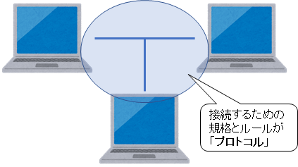
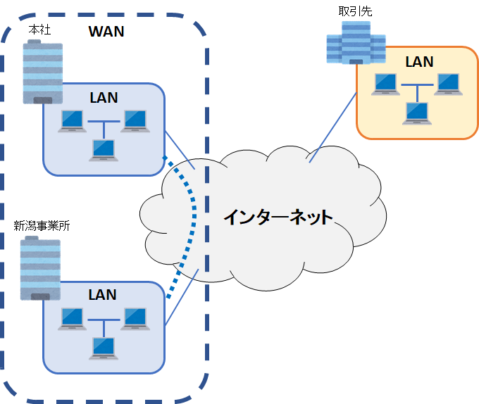
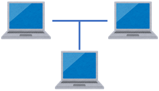
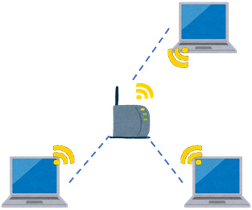

第1章 ネットワークとは？
=====

[↑ 目次](README.md "目次")

ネットワークとは何か
-----

そもそも「ネットワーク」とは何でしょうか？

仮にあなたが一人だけで作業していて、PCも1台しかないのであれば、そこにネットワークは必要ありません。

図1-1 単独作業のイメージ

しかし、これは現実的ではありません。仕事は複数人で行うことが常ですし、インターネットを使って調査もしたいでしょう。そう考えると、ネットワークとは複数人、複数台のPCなどのやり取りをするために生まれたものだということが分かります。

図1-2 協力作業のイメージ

次に考えるのは、「どうやってやり取りをすればよいか」です。複数台の機器があったとしても、それをつなげる手段が無ければそもそも接続することはできません。また、仮に接続できたとしても、お互いに同じ通信手順、ルールを用いない限り、決して通信はできません。

これは、私たちが普段話している「言葉」に似ています。「英語」と「日本語」では会話はできませんし、同じ「日本語」を話していてもそれぞれが使う用語や名前などが違えばやはり意思の疎通はできません。同じ言語で同じルールがあるからこそ、会話が成り立つのです。

図1-3 言語とルールに則った会話

したがって、ネットワークとは「複数台の機器を規格や通信ルールを定めて接続したもの」と言えます。この「規格や通信ルール」のことを「プロトコル(Protocol:外交儀礼、儀典、礼儀作法、慣習の意)」と呼びます。たとえ別の国で作られた機器であっても、同じプロトコルに従って作られていれば接続して通信することができます。

図1-4 ネットワークとプロトコル

ネットワークの種類
-----

では、具体的にネットワークにはどんなものがあるのでしょうか。いくつかの視点から考えてみます。

### 範囲で見たネットワーク

まず、接続する機器の範囲から見たネットワークの種類を見てみましょう。大きく分けて、次の3つがあります。

1. LAN
2. インターネット
3. WAN

図1-5 範囲で見たネットワークの種類

#### 1. LAN

最も狭い範囲のネットワークが「LAN(**L**ocal **A**rea **N**etwork)：ラン」です。一つの部屋、一つのフロア、一つの建物といった、物理的に近い範囲のネットワークがこう呼ばれます。

#### 2. インターネット

それぞれのLANの間にあるネットワークが「インターネット(Internet)」です。"Inter"とは「間の」という意味があり、まさにネットワークとネットワークの間を取り持つネットワークです。Webページなどは、自分が今いるネットワークから事業者が提供する別のネットワークにある資源を、インターネットを介して取得し、表示していることになります。

#### 3. WAN

大きい組織では、複数の事業所間で情報のやり取りが必要になります。ただし、それは組織外部には秘密の通信として行わなければなりません。こういった、LANとLANの間を安全な通信でつないだより広範囲のネットワークが「WAN(**W**ide **A**rea **N**etwork)：ワン」です。

WANにおけるLANとLANの間の通信方法の一つが「VPN(**V**irtual **P**rivate **N**etwork)：ブイピーエヌ、仮想プライベートネットワーク」と呼ばれる仮想的なネットワークです。VPN自体は、インターネットを経由したInternet VPNや回線業者が提供する閉域VPNといった種類があります。

### 通信手段で見たネットワーク

今度は何を使って通信するかで見たネットワークの種類を見てみましょう。大きく次の2つあります。

1. 有線
2. 無線

#### 1. 有線

接続する機器同士を物理的なケーブル(線)で直接接続するのが有線形式です。

図1-6 有線接続

通信のためのケーブルは主に次の2つが使われます。

- LANケーブル、イーサネットケーブル  
  有線LANの規格の一つ「Ethernet(イーサネット)」で用いられるケーブルで、2018年現在最も一般的な有線接続ケーブル  
  電気信号で通信するための銅線が数本束ねられている
- 光ケーブル  
  光通信のためのケーブルで、内部は光ファイバになっている  
  ONU(光回線終端装置)を介してLANに変換する

#### 2. 無線

機器同士のやり取りを、電波を通じた無線通信で行うのが無線形式です。

図1-7 無線接続

2018年現在ではほぼ「Wi-Fi」だけが使われていて、通信したい機器は、それぞれアクセスポイント(AP:**A**ccess **P**oint)という専用の機器を介して通信を行います。

- - - - -

次の章からは、具体的のどうやってネットワークの通信が行われているのか、詳しく見ていきましょう。

[→ 第2章 2つのアドレス](02.md "第2章 2つのアドレス")