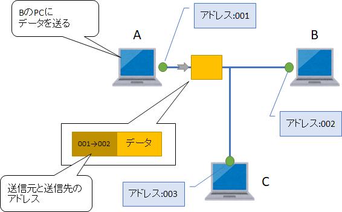
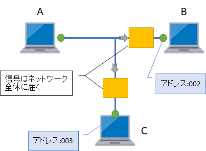
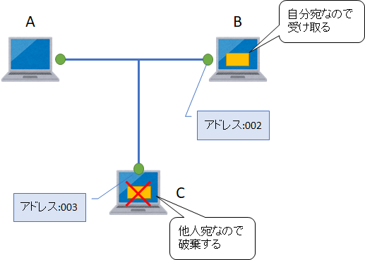

第2章 2つのアドレス
=====

[↑ 目次](README.md "目次")

[← 第1章 ネットワークとは？](01.md "第1章 ネットワークとは？")

アドレスの必要性
-----

複数台のPCでネットワークを作り、データを送りたいとしましょう。このとき、データを送りたい相手のPCをどうやって指定すればよいでしょうか？

2台だけで作られたネットワークであれば、「自分でない誰か」に向けてデータを送ることもできるでしょう。しかし、3台以上ある場合、データの送り先を何とかして特定しなくてはいけません。

そのために必要なのが「アドレス(Address)」です。日本語では「住所」と訳されるアドレスですが、ネットワークにおけるアドレスも、その機器の住所として使います。宛名に住所と名前を書いて手紙を出すように、宛先のアドレスを指定してデータを送ることで、送られた相手が自分宛だと判断してデータを受け取ります。

LANを使ってデータを送る手順のイメージを見てみましょう。

まず、A-Cの3台のPCからなるネットワークがあったとしましょう。この時PC AがPC Bにデータを送りたいので、AのアドレスからBのアドレスへの送信だという情報とともにデータをネットワークに対して送り出します。



図2-1 AからB宛のデータ送信

送られたデータは電気や光、電波などの信号になってネットワーク全体に行きわたります。通信したい相手とだけつながっているわけではないため、全体に信号が送られるのは仕方がないことです。



図2-2 通信がネットワーク全体に行きわたる

データが届くと、届いたデータに付けられた送信先アドレスを自分のアドレスと比較し、自分宛なら受け取りそうでなければデータを破棄します。



図2-3 データの受け取り

以上のように、ネットワークを介した通信では、アドレスが重要な役目を果たしていることが分かります。


2つのアドレス
-----

データの宛先を指定するためのアドレスは、ネットワーク機器に付けられた「NIC(**N**etwork **I**nterface **C**ard)：ニック、ネットワークインターフェースカード」に対して、1:1に設定します。PCがLANカードとWi-Fiに対応していれば、NICがそれぞれに対して1つずつあるので、PCのアドレスは都合2つつくことになります。

さて、これまで単に「アドレス」と呼んできましたが、実際には2つのアドレスがあります。それが「物理アドレス」と「論理アドレス」です。

### 物理アドレス

NICの製造時にあらかじめ設定されるアドレスが「物理アドレス」です。一般には「MAC(**M**edia **A**ccess **C**ontrol)アドレス」とも呼ばれています。

物理アドレスは48bitあり、16進数を使って次のように表現されます。

```
xx-yy-zz-AA-BB-CC
```

このうち、先頭の`xx-yy-zz`を「ベンダーID部」と呼び、NICの製造元ごとに定められた固有の値が設定されています。残りの部分は`AA`を「機種ID」、`BB-CC`を「シリアルID」と呼びます。NICの製造元ごとに機種IDとシリアルIDを管理することで、同じ物理アドレスを持ったNICが2つとないようになっています。

物理アドレスは主に「同じネットワーク内に存在するNIC」を識別するために使われます。とはいえ、私たちが直接使うというよりは、ネットワーク機器が良しなに扱ってくれますので、普段はほとんど意識することはないでしょう。ただし、Wi-Fiのアクセスを社員だけに制限する目的で、接続可能な物理アドレスを登録するといった用途では使われます。

### 論理アドレス

NICに対して私たちが自由に設定できるアドレスが「論理アドレス」です。一般には「IP(**I**nternet **P**rotocol)アドレス」と呼ばれています。

IPアドレスにはv4とv6の2つのバージョンがあり、現在主流なのはv4の方です。IPv4アドレスは32bitあり、8ビットごと10進数にし、"."でつないで次のように表現されます。

```
192.168.0.1
```

このIPアドレスは先頭からのbit数を指定して、ネットワーク部と端末を表すホスト部に分けることができます。ネットワーク部が同じなら、論理的に同じネットワークとみなすことができます。

例えば、先頭から24bitをネットワーク部として使うことは、24bit分を1にした2進数表現`255.255.255.0`で表現し、これを「サブネットマスク」と呼びます。このサブネットマスクとIPアドレスをAND演算した結果がネットワークアドレスとなります。

例えば、上記のアドレスにサブネットマスク`255.255.255.0`を指定すると、次のようにAND演算され、ネットワークアドレスが`192.168.0.0`であることが分かります。

```
     11111111 11111111 11111111 00000000
AND) 11000000 10101000 00000000 00000001
-----------------------------------------
     11000000 10101000 00000000 00000000 = 192.168.0.0
```

ネットワーク部に続く残りのbitはホスト部になります。上記の場合は、ホスト部は1になります。

なお、自由に設定できるとは言っても、アドレスは全世界で一意にならなければいけないため、「ICANN」という団体がどこが何を使っているかを管理しています。その中には「プライベートIPアドレス」といい、各組織で自由に使ってよいこととなっている範囲が定められていますので、各組織でこのアドレスを使って各PCなどに割り当てるようネットワークを設計します。

プライベートIPアドレスは次のクラスAからクラスCの3種類あります。IPアドレスの範囲は`a.b.c.d/n`と表記します。`a.b.c.d`がネットワークアドレス、`n`が先頭からのbit数です。

- クラスA: `10.0.0.0/8`  
  `10.0.0.0` - `10.255.255.255`
- クラスB: `172.16.0.0/12`  
  `172.16.0.0` - `172.31.255.255`
- クラスC: `192.168.0.0/16`  
  `192.168.0.0` - `192.168.255.255`


アドレスの確認方法
-----

本章の最後に、PCのNICに付与された物理アドレス、論理アドレスを確認する方法を学びましょう。

その方法は、「コマンドプロンプト」を起動して次のコマンドを実行するだけです。

```
ipconfig /all
```

実行結果は次のように表示されます。

```
C:\Users\takano-s>ipconfig /all

Windows IP 構成

   ホスト名. . . . . . . . . . . . . . .: xxxxx
   プライマリ DNS サフィックス . . . . .: hoge.example.com
   ノード タイプ . . . . . . . . . . . .: ハイブリッド
   IP ルーティング有効 . . . . . . . . .: いいえ
   WINS プロキシ有効 . . . . . . . . . .: いいえ
   DNS サフィックス検索一覧. . . . . . .: hoge.example.com

イーサネット アダプター イーサネット:

   メディアの状態. . . . . . . . . . . .: メディアは接続されていません
   接続固有の DNS サフィックス . . . . .:
   説明. . . . . . . . . . . . . . . . .: Intel(R) 82577LM Gigabit Network Connection
   物理アドレス. . . . . . . . . . . . .: 6C-62-6D-21-37-36
   DHCP 有効 . . . . . . . . . . . . . .: いいえ
   自動構成有効. . . . . . . . . . . . .: はい

Wireless LAN adapter Wi-Fi:

   接続固有の DNS サフィックス . . . . .: hoge.example.com
   説明. . . . . . . . . . . . . . . . .: Intel(R) Centrino(R) Advanced-N 6200 AGN
   物理アドレス. . . . . . . . . . . . .: 18-3D-A2-8C-29-B8
   DHCP 有効 . . . . . . . . . . . . . .: はい
   自動構成有効. . . . . . . . . . . . .: はい
   リンクローカル IPv6 アドレス. . . . .: fe80::2c:cbf1:9d22:91e8%13(優先)
   IPv4 アドレス . . . . . . . . . . . .: 192.168.10.114(優先)
   サブネット マスク . . . . . . . . . .: 255.255.255.0
   リース取得. . . . . . . . . . . . . .: 2018年4月26日 9:07:28
   リースの有効期限. . . . . . . . . . .: 2018年4月27日 0:07:29
   デフォルト ゲートウェイ . . . . . . .: 192.168.10.xx
   DHCP サーバー . . . . . . . . . . . .: 192.168.0.xx
   DHCPv6 IAID . . . . . . . . . . . . .: 202915234
   DHCPv6 クライアント DUID. . . . . . .: 00-01-00-01-1F-2C-C8-89-6C-62-6D-21-37-36
   DNS サーバー. . . . . . . . . . . . .: 192.168.0.xx
                                          192.168.4.xx
                                          192.168.3.xx
                                          8.8.8.8
   NetBIOS over TCP/IP . . . . . . . . .: 有効
```

この結果を見ると、有線LANカードの物理アドレスは`6C-62-6D-21-37-36`であり、LANケーブルが接続されておらずIPアドレスは設定されていないことが分かります。また、Wi-Fiについては、物理アドレスが`18-3D-A2-8C-29-B8`、IPアドレスが`192.168.10.114`であることが分かります。

この他にも多くの情報が表示されていますが、それぞれについては必要に応じて後の章で紹介しましょう。今回覚えておいて欲しいことは、NICの情報を取得するには`ipconfig`コマンドが使えるということです。

- - - - -

ネットワーク機器を指定するためのアドレスについて分かったので、今度は具体的にどのようにネットワークを構築していくか、次の章から学んでいきます。

[→ 第3章 小規模なネットワーク](03.md "第3章 小規模なネットワーク")