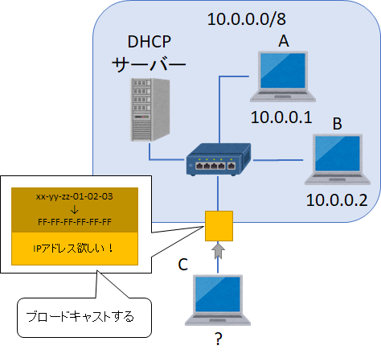

第3章 小規模なネットワーク
=====

[↑ 目次](README.md "目次")

[← 第2章 2つのアドレス](02.md "第2章 2つのアドレス")

2台のネットワーク
-----

具体的なネットワークの作り方を順に学んでいきましょう。まずは最小構成の2台でのネットワークの作り方です。

2台のPCでネットワークを作るにはまず、LANケーブルを使って2台を直接接続します。


図3-1 2台の接続

しかし、ただ接続しただけでは通信はできません。第2章で学んだように、同じネットワークのIPアドレスを2台それぞれに設定しなければなりません。

ここでは仮にクラスAのプライベートアドレスを次のように設定することにします。サブネットマスクは同じ値を設定しないと、2台が同じネットワークにあるとみなされないため、通信ができないことに注意してください。

|     | A   | B   |
| --- | --- | --- |
| IPアドレス | 10.0.0.1 | 10.0.0.2 |
| サブネットマスク | 255.0.0.0 | 255.0.0.0 |

このように設定することで、初めて2台が同じネットワークに属することになり、通信が可能になります。


図3-2 2台のネットワーク

- - - - -

#### [コラム] WindowsのIPアドレス自動設定機能

Windowsの場合、LANケーブルで2台をつなぐとお互いに同じネットワークのIPアドレスを調整して設定してくれる、「APIPA」と呼ばれる機能があります。APIPAで設定されるアドレスは`169.254.x.x`であり、「LINKLOCALアドレス」と呼ばれます。

ただ、この機能を使うのはごくごく小規模のネットワークで一時的にアドレスを設定しないといけないときだけにしましょう。Windows限定の機能ですし、設定されるIPアドレスも制御できないためです。

- - - - -


ネットワークの疎通確認
-----

上のように設定することで2台のネットワークが作れます。ただ、実際に通信できるかどうかを確認したほうが良いでしょう。

ネットワークの疎通確認は、次のように`ping`(ピン)コマンドを使います。この名前はピンポン(ping pong)のpingと同じものです。

```
ping (宛先IPアドレス)
```

通信が可能な時は、次のように結果が表示されます。

```
C:\>ping 192.168.0.251

192.168.0.251 に ping を送信しています 32 バイトのデータ:
192.168.0.251 からの応答: バイト数 =32 時間 =2ms TTL=255
192.168.0.251 からの応答: バイト数 =32 時間 =3ms TTL=255
192.168.0.251 からの応答: バイト数 =32 時間 =3ms TTL=255
192.168.0.251 からの応答: バイト数 =32 時間 =6ms TTL=255

192.168.0.251 の ping 統計:
    パケット数: 送信 = 4、受信 = 4、損失 = 0 (0% の損失)、
ラウンド トリップの概算時間 (ミリ秒):
    最小 = 2ms、最大 = 6ms、平均 = 3ms
```

上記のように、「(宛先IPアドレス)からの応答」が表示されれば、問題なく通信ができています。ただ、仮に「時間 = XXms」の時間が大きかったり、ばらつきがある場合は、ネットワークに何らかの障害があってうまく通信できていない可能性があります。こんな時は、近くにいるPC管理者に相談してください。

通信に失敗し、宛先IPアドレスからの応答がなかった時は、次のように結果になります。

```
C:\>ping 192.168.0.252

192.168.0.252 に ping を送信しています 32 バイトのデータ:
要求がタイムアウトしました。
要求がタイムアウトしました。
要求がタイムアウトしました。
要求がタイムアウトしました。

192.168.0.252 の ping 統計:
    パケット数: 送信 = 4、受信 = 0、損失 = 4 (100% の損失)、
```

こうなってしまったときは、次のように順に確認し、問題を切り分けて対処してください。6番については「ファイアウォール(FW:**F**ire **W**all)」という機能で設定します。詳しくは後の章で紹介します。

1. LANケーブルは接続されているか
2. IPアドレスの設定が間違っていないか
3. サブネットマスクの設定が間違っていないか
4. 宛先IPアドレスが間違っていないか
5. 宛先のPCは起動しているか
6. 宛先のPCで`ping`コマンドに応答しないように設定されていないか


3台以上のネットワーク
-----

今度は3台以上でネットワークを作ることを考えてみましょう。

3台以上の場合、それぞれを直接LANケーブルで接続することができなくなります。したがって、LANケーブルの他に、ネットワーク接続を集約する機器が必要になります。

その機器を「L2スイッチ(L2SW)」と言います。他にも、「スイッチングハブ」または単に「ハブ」や単に「スイッチ」と呼ばれることもあります(「ハブ(Hub)」は「集まるところ」というような意味)。それぞれのPCとL2SWをLANケーブルで接続すると、PCから送信された信号をL2SWが中継して他のPCに伝送してくれます。


図3-3 3台以上の接続

IPアドレスおよびサブネットマスクは、2台の時と同様におなじネットワークのアドレスとしてそれぞれ設定すればOKです。

- - - - -

#### [コラム] L2とは？

「L2スイッチ」の「L2」とは「**L**ayer 2」の略式表記です。

現代のネットワークは次のように7つ層(Layer)で構成されるように設計されています。これを「OSI参照モデル」といいます。

| 層 | 名前 |
| -- | ---- |
| 7 | アプリケーション層 |
| 6 | プレゼンテーション層 |
| 5 | セッション層 |
| 4 | トランスポート層 |
| 3 | ネットワーク層 |
| 2 | データリンク層 | 
| 1 | 物理層 |

「L2スイッチ」は「Layer 2」、つまり「データリンク層」の範囲でデータを伝送するためのスイッチということになります。

データリンク層は、前述の「MACアドレス」を使ってデータの通信を行います。したがって、L2スイッチでは、ケーブルで接続された先のNICが持つMACアドレスを使って、データを転送してくれるということになります。

なお、「IPアドレス」は「Layer 3」、つまり「ネットワーク層」のアドレスです。そして、IPアドレスを使って数審する仕組みのことを「**I**nternet **P**rotocol」といいます。

なお、このような通信を行うための規格、仕組みのことを「プロトコル」と言います。したがって、IPは「ネットワーク層のプロトコル」であるといえます。

- - - - -


無線LANの接続
-----

無線LAN(Wi-Fi)の場合、無線の電波がLANケーブル、アクセスポイント(AP)がL2SWに対応するものとみなすことで、3台以上のネットワークの構成とほぼ同じになります。したがって、Wi-Fiもデータリンク層のプロトコルであるといえます。


図3-4 無線LANの接続


IPアドレスの自動設定
-----

複数の機器を同じネットワークに配置するには、それぞれの機器をL2スイッチ(無線LANならAP)で接続し、同じネットワークアドレスのIPアドレスを設定すればよいことが分かりました。

ただ、数台程度ならともかく、実際にはもっと多くの機器を接続することの方が多いでしょうし、そもそも自分で細かにIPアドレスを設定するのは、単純に面倒ですしミスもしやすくなります。

そこで、IPアドレスを自動で設定してくれる仕組みがあります。それが「DHCP(**D**ynamic **H**ost **C**onfiguration **P**rotocol)」です。

DHCPはIPアドレスを配布する「DHCPサーバー」と、IPアドレスを要求する「DHCPクライアント」で構成されています(DHCPクライアントの機能はWindowsに含まれています)。

IPアドレスを自動設定するには、まずDHCPクライアントが自身のMACアドレスを添えて宛先MACアドレス`FF-FF-FF-FF-FF-FF`にIPアドレスの要求をします。この`FF-FF-FF-FF-FF-FF`は「ブロードキャストアドレス」と呼ばれ、ケーブルやL2スイッチに接続されたすべての機器にデータが送られます。



図3-5 IPアドレスの要求

DHCPサーバーがこのIPアドレスの要求を受け取ると、事前にDHCPサーバーに設定された配布可能なIPアドレスから、既に払い出されたIPアドレスと重複しないように選んだIPアドレスを、DHCPクライアントから送られたMACアドレス宛に送り返します。


図3-6 IPアドレスの応答

DHCPクライアントはDHCPサーバーからの応答を受け取ると、自身のNICにIPアドレスとサブネットマスクを設定し、ネットワークへの参加が完了します。


図3-7 IPアドレスの設定

- - - - -

#### [コラム] WindowsのIPアドレスの設定方法

Windowsの場合、［コントロールパネル］の［ネットワークとインターネット］ー［ネットワーク接続］より対象のNICのプロパティを表示し、［インターネット プロトコル バージョン 4 (TCP/IPv4)］のプロパティを開き、［IPアドレスを自動的に取得する］を選択することで、DHCPクライアントを有効にできます。


図3-8 WindowsのDHCPクライアント有効化

おなじ画面で［次のIPアドレスを使う］を選択し、IPアドレスとサブネットマスクを入力すると、自分で任意のIPアドレスを設定することもできます。

- - - - -

複数台のPCや機器を同じネットワークに配置する方法について学びました。次の章では異なるネットワーク間で通信を行う方法について学びましょう。

[→ 第4章 ネットワークの連結](04.md "第4章 ネットワークの連結")

