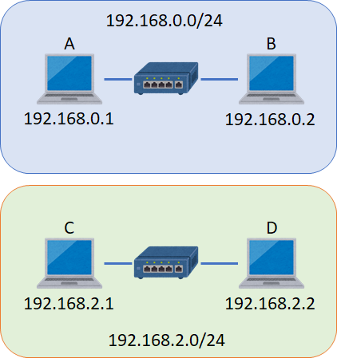
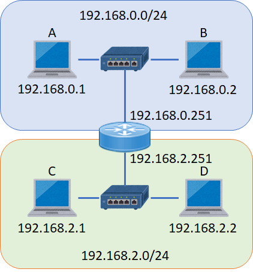
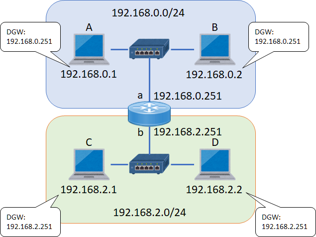
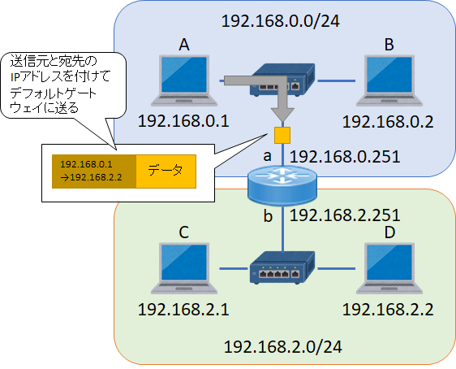
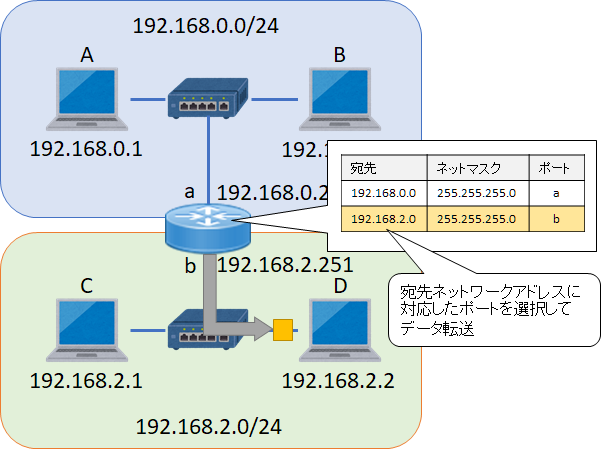

第4章 ネットワークの連結
=====

[↑ 目次](README.md "目次")

[← 第3章 小規模なネットワーク](03.md "第3章 小規模なネットワーク")


異なるネットワークの接続
-----

前章では複数のネットワーク資源を一つのネットワークに配置する方法を学びました。ただ、現実的にはインターネットをはじめとする他のネットワークとも通信を行う必要もあります。

そこで、本章では異なるネットワークを相互に接続する方法について学びましょう。

さて、ここで次のように`192.168.0.0/24`と`192.168.2.0/24`2つのネットワークがあるとしましょう。



図4-1 2つのネットワーク

この2つのネットワークの間で通信することを考えます。まず、2つのネットワークの境目に、「L3スイッチ(L3SW)」または「ルーター」と呼ばれる機器を配置し、それぞれのネットワークのL2SWとLANケーブルで接続します。



図4-2 L3SWの設置

「L3スイッチ」は「**L**ayer 3」のスイッチという名の通り、複数のLANケーブルを接続するための「ポート」を持っており、それぞれに異なるIPアドレスを付与できます。そこで、2つのネットワークとの接続に、それぞれのネットワークと同一のIPアドレス(およびサブネットマスク)を設定します。ここでは、ポートaに`192.168.0.251`、ポートbに`192.18.2.251`というIPアドレスを設定したとしましょう。

今度はL3SWに「ルーティングテーブル」というどのネットワーク宛の通信をどのポートに転送するかを指定するための情報を登録します。例えば、`192.168.0.0/24`宛はポートa、`192.168.2.0/24`宛はポートbに転送するよう、次のように登録します。

| 宛先ネットワーク | ネットマスク | ポート |
| --- | --- | --- |
| 192.168.0.0 | 255.255.255.0 | a |
| 192.168.2.0 | 255.255.255.0 | b |

最後に、各ネットワークに接続された機器のNICに対して、IPアドレス、サブネットマスクに加えて、「デフォルトゲートウェイ(DGW)」となるIPアドレスを設定します。デフォルトゲートウェイとは、自分が参加しているネットワーク以外に向けた通信を、どのIPアドレスに向けて送るかを指定するもので、原則的にはL3SWのIPアドレスを指定します。例えば、CやDのPCなら、自分のネットワークに接続されたL3SWのポートのアドレス`192.168.2.251`を設定します。



図4-3 デフォルトゲートウェイの設定

以上でネットワークの接続は完了です。

なお、1台1台すべてにデフォルトゲートウェイの設定を行うのはあまり現実的ではありません。IPアドレスと同様にDHCPで配布できるようになっていますので、通常はそちらの手段を使って設定します。


異なるネットワーク向けの通信手順
-----

それでは、AのPCからDのPCにデータを送る際、どのように通信が行われるか見ていきましょう。

まず、AのPCでは、宛先IPアドレス`192.168.2.2`が自身のネットワークアドレス`192.168.0.0/24`とは異なるので、まずはデフォルトゲートウェイ`192.168.0.251`宛にデータを送ります。



図4-4 他のネットワーク向けデータの送信

L3SWは受け取ったデータの宛先を自身が持つルーティングテーブルと突き合わせて、データを転送するポートを決定し、データを送り出します。ここでは、`192.168.2.0/24`宛のデータなので、ポートbにデータを送り出します

ポートbから送出されたデータは、L2SWを経由して目的のPC Dに届きます。



図4-5 ルーティングテーブルの突合せ

- - - - -

#### [コラム] PCのルーティングテーブル

PC自体にもルーティングテーブルが登録されています。登録内容は次のように`route`コマンドを使って確認できます。

```
C:\>route print
===========================================================================
インターフェイス一覧
  7...6c 62 6d 21 37 36 ......Intel(R) 82577LM Gigabit Network Connection
 13...18 3d a2 8c 29 b8 ......Intel(R) Centrino(R) Advanced-N 6200 AGN
  2...02 00 01 02 03 04 ......VNiC Driver
  1...........................Software Loopback Interface 1
===========================================================================

IPv4 ルート テーブル
===========================================================================
アクティブ ルート:
ネットワーク宛先        ネットマスク          ゲートウェイ       インターフェイス  メトリック
          0.0.0.0          0.0.0.0   192.168.10.251   192.168.10.114     50
        127.0.0.0        255.0.0.0            リンク上         127.0.0.1    331
        127.0.0.1  255.255.255.255            リンク上         127.0.0.1    331
  127.255.255.255  255.255.255.255            リンク上         127.0.0.1    331
      169.254.0.0      255.255.0.0    192.168.10.74   192.168.10.114     51
     192.168.10.0    255.255.255.0            リンク上    192.168.10.114    306
   192.168.10.114  255.255.255.255            リンク上    192.168.10.114    306
   192.168.10.255  255.255.255.255            リンク上    192.168.10.114    306
        224.0.0.0        240.0.0.0            リンク上         127.0.0.1    331
        224.0.0.0        240.0.0.0            リンク上    192.168.10.114    306
  255.255.255.255  255.255.255.255            リンク上         127.0.0.1    331
  255.255.255.255  255.255.255.255            リンク上    192.168.10.114    306
===========================================================================
固定ルート:
  ネットワーク アドレス          ネットマスク  ゲートウェイ アドレス  メトリック
      169.254.0.0      255.255.0.0    192.168.10.74       1
===========================================================================
```

「IPv4 ルートテーブル」の一番上のレコードに注目してみましょう。

```
ネットワーク宛先        ネットマスク          ゲートウェイ       インターフェイス  メトリック
          0.0.0.0          0.0.0.0   192.168.10.251   192.168.10.114     50
```

「ネットワーク宛先」が`0.0.0.0`というのは、登録されたどの宛先ネットワークにも該当しない場合に選択されるレコードを表しています。そして、「ゲートウェイ」を見ると`192.168.10.251`となっており、L3SWのアドレスが設定されています。

このPC内のルーティングテーブルは`route add`コマンドを使って自分でレコードを追加することもできます。仮に特定のネットワーク宛の通信を、デフォルトゲートウェイではない特定のL3SWに向けて送信したいといったときに設定することになるでしょう。

- - - - -


通信経路の確認手段
-----

前述のように異なるネットワークはL3SWで接続されています。これは社内の小規模なネットワークに限らず、インターネットを介した通信でも同様です。

このように複数のネットワークを経由して通信が行われますが、何らかの通信障害があり、通信できなくなった場合、どこで障害が発生しているのかを調べなければなりません。言い換えると、宛先ネットワークへの「経路」を調べるということです。

そのためのコマンドが2つあります。一つは`tracert`、もう一つが`pathping`です。

 ### `tracert`

 `tracert`コマンドは、宛先ネットワークへの経路(ルート、route)の応答時間などを調べるためのコマンドです。

 ```
 C:\>tracert 8.8.8.8

google-public-dns-a.google.com [8.8.8.8] へのルートをトレースしています
経由するホップ数は最大 30 です:

  1     3 ms     2 ms     2 ms  192.168.2.251
  2     1 ms     1 ms    <1 ms  192.168.0.5
  3     3 ms     3 ms     3 ms  27.93.251.98
  4     9 ms     9 ms     9 ms  10.199.199.46
  5    10 ms     9 ms    11 ms  oymbbar003-1.bb.kddi.ne.jp [27.86.35.97]
  6    13 ms    14 ms    13 ms  27.80.241.173
  7    12 ms    12 ms    12 ms  27.85.230.54
  8    12 ms    12 ms    12 ms  74.125.51.213
  9     *        *        *     要求がタイムアウトしました。
 10    13 ms    13 ms    13 ms  216.239.41.68
 11    12 ms    12 ms    12 ms  72.14.235.225
 12    13 ms    12 ms    12 ms  google-public-dns-a.google.com [8.8.8.8]

トレースを完了しました。
```

`tracert`に続けて宛先IPアドレスを指定すると、通信経路のIPアドレスとその応答時間が3回分表示されます。

### `pathping`

`pathping`コマンドは`tracert`コマンドをパワーアップさせたようなコマンドで、宛先への経路と応答時間や送ったデータの損失率などの統計情報を調べるためのコマンドです。

```
C:\Users\takano-s>pathping 8.8.8.8

google-public-dns-a.google.com [8.8.8.8] へのルートをトレースしています
経由するホップ数は最大 30 です:
  0  xxx.hoge.example.com [192.168.2.122]
  1  192.168.2.251
  2  192.168.0.5
  3  27.93.251.98
  4  10.199.199.46
  5  oymbbar003-1.bb.kddi.ne.jp [27.86.35.97]
  6  27.80.241.173
  7  27.85.230.54
  8  74.125.51.213
  9     *        *        *
統計を 200 秒間計算しています...
            ソースからここまで   このノード/リンク
ホップ  RTT    損失/送信 = Pct  損失/送信 = Pct  アドレス
  0                                           xxx.hoge.example.com [192.168.2.122]
                                0/ 100 =  0%   |
  1    4ms     0/ 100 =  0%     0/ 100 =  0%  192.168.2.251
                                0/ 100 =  0%   |
  2    1ms     0/ 100 =  0%     0/ 100 =  0%  192.168.0.5
                                0/ 100 =  0%   |
  3    4ms     0/ 100 =  0%     0/ 100 =  0%  27.93.251.98
                                0/ 100 =  0%   |
  4    9ms     0/ 100 =  0%     0/ 100 =  0%  10.199.199.46
                                0/ 100 =  0%   |
  5    9ms     0/ 100 =  0%     0/ 100 =  0%  oymbbar003-1.bb.kddi.ne.jp [27.86.35.97]
                                0/ 100 =  0%   |
  6   14ms     0/ 100 =  0%     0/ 100 =  0%  27.80.241.173
                                0/ 100 =  0%   |
  7   12ms     0/ 100 =  0%     0/ 100 =  0%  27.85.230.54
                                0/ 100 =  0%   |
  8   12ms     0/ 100 =  0%     0/ 100 =  0%  74.125.51.213

トレースを完了しました。
```

`tracert`と同様に宛先IPアドレスを指定して実行すると、経路とその応答時間(RTT:**R**ound **T**rip **T**ime)およびデータの損失率を既定では200秒間の統計情報として表示します。


こういった`tracert`や`pathping`の結果を見ることで、どこまで通信が行えているのかを確認できます。仮に応答がなくなるのが社内のIPアドレスなら、そのネットワーク機器の周りを重点的に調べることになりますし、社外のIPアドレスならプロバイダーなどの障害を疑うことができます。

- - - - -

ここまでの章で、IPアドレスを使ってネットワークをまたいで通信できる仕組みを学びました。次の章からは、その上で通信するためのより高度な内容について学んでいきましょう。

[→ 第5章 アドレスと名前](05.md "第5章 アドレスと名前")