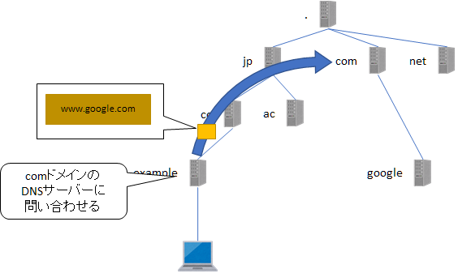
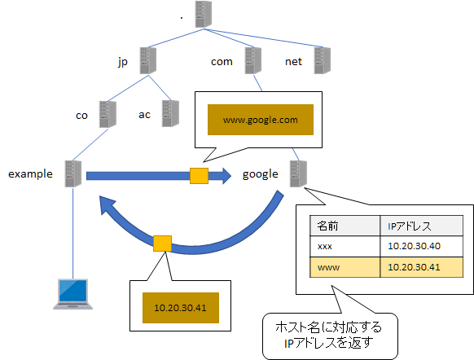

第5章 アドレスと名前
=====

[↑ 目次](README.md "目次")

[← 第4章 ネットワークの連結](04.md "第4章 ネットワークの連結")

名前の必要性
-----

これまでの章では、ネットワークに接続した機器を特定するために物理アドレスとIPアドレスの2つを使ってきました。これらのアドレスは、機器を一意に特定するためには非常に便利なのですが、英数字の羅列でしかないため、普段使いするにはあまり向いていません。

例えば、Webサイトを閲覧することを考えてみましょう。仮にアドレスしかなかったとしたら、見たい情報を持っているWebサイトそれぞれのIPアドレスをすべて覚えて置かないといけないことになってしまいます。これでは、人に伝えるにも一苦労です。

そこで、IPアドレスに「名前」を付けて、IPアドレスと相互に変換できる仕組みがあります。それが「DNS(**D**omain **N**ame **S**ystem)」です。


DNSにおける名前
-----

DNSでは、サーバー等の名前を「ドメイン名」と「ホスト名」で識別します。例えば、Google社のWebサイトを管理しているサーバー名は`www.google.com`です。

このうち、先頭の`www`がホスト名、その後ろの`google.com`がドメイン名を表し、`.`で接続されています。


図5-1 DNSにおける名前の構成

ドメイン名は見るとわかるようにさらに`.`で区切られた形です。これは、最後尾を頂点として、ドメインが階層化されていることを表しています。


図5-2 ドメイン名の階層

この頂点を「ルートドメイン」といい、名前なしか`.`で表します。

そのルートドメインの直下は「トップレベルドメイン(TLD:**T**op **L**evel **D**omain)」といいます。`jp`や`uk`のような国コードを使った「国別トップレベルドメイン(ccTLD:**c**ountry **c**ode)」や、`com`、`net`など3文字以上の「ジェネリックトップレベルドメイン(gTLD:**g**eneric)」が「IANA」という組織によって定められています。

`jp`ccTLDの下には、会社を表す`co`や教育機関を表す`ac`などの「セカンドレベルドメイン」があります。セカンドレベルドメインについては、親となるTLDを管理する団体が定めているため、他の国では`co`や`ac`などがない場合もあります。なお、gTLDの下にはセカンドレベルドメインはありません。

そして、gTLDやセカンドレベルドメインの下に、各組織や団体などの個別ドメインがぶら下がっています。

このように階層化することで、各ドメインを管理する団体は、自分の直下のドメインだけ管理すればよいようになっているのです。

ちなみに、先述の`www.google.com`のようなホスト名をドメイン名と連結した、正式なドメイン名のことを、「完全修飾ドメイン名(FQDN:**F**ull **Q**ualified **D**omain **N**ame)」と言います。


名前解決の動作イメージ
-----

DNSはDHCPと同様に「DNSサーバー(もしくはネームサーバー)」と「DNSクライアント」からなり、DNSクライアントがDNSサーバーに名前に対応するIPアドレスを要求すると、DNSサーバーがそれに応えるというのが基本的な形です。

この「名前からIPアドレスを取得する」とことは「名前解決」とも呼び、IPアドレスが取得できなかった時は「名前解決に失敗した」というように使います。


図5-3 DNSの基本イメージ

ただ、実際は前述のようにドメインは階層化されているため、各階層のそれぞれのドメイン毎にDNSサーバーが存在します。そして、DNSクライアントから自分が管理していないドメイン名の要求があった場合、上位のDNSサーバーに繰り返し問い合わせていきます。

まず、`example.co.jp`に配置されたDNSクライアントから、`www.google.com`への要求が`example.co.jp`のDNSサーバーに送信されます。


図5-4 他のドメインのホスト名の要求

すると、要求を受け取った`example.co.jp`のDNSサーバーは、要求された名前が自分のドメインではなかったので、まず最上位のルートドメインのDNSサーバーに、`com`ドメインのDNSサーバーを問い合わせます。


図5-5 ルートドメインのDNSサーバーへの問合せ

すると、`com`ドメインのDNSサーバーが分かるので、今度はそちらに反復的に問合せを行います。



図5-6 下位のDNSサーバーへの問合せ

このようにして、`google.com`を管理するDNSサーバーに要求が届くと、管理しているホスト名とIPアドレスの一覧から一致するものを選び、IPアドレスを`example.co.jp`のDNSサーバーに返します。



図5-7 目的のホストアドレスが判明

最後に、`example.co.jp`のDNSサーバーは、判明したIPアドレス`10.20.30.41`をDNSクライアントに返します。


図5-8 DNSクライアントへの応答


DNSサーバーアドレスの設定
-----

PCなどが名前解決を行うためには、最初に問い合わせるDNSサーバーを知っていなくてはなりません。そのため、事前にDNSサーバーのIPアドレスを設定しておく必要があります。

Windowsでは［インターネット プロトコル バージョン 4 (TCP/IPv4)］のプロパティ画面で、［次のDNSサーバーのアドレスを使う］を選択し、［優先DNSサーバー］、［代替DNSサーバー］にIPアドレスを入力します。ちなみに「優先」、「代替」があるのは、まず優先側に問い合わせ、回答がなかった(サーバーが停止している、など)場合に代替側に問い合わせるためです。


図5-9 DNSサーバーアドレスの設定

なお、DHCPを使って設定することもでき、その時は上の「DNSサーバーのアドレスを自動的に取得する」を選択します。


名前解決の動作確認
-----

Webブラウザーなどのアプリケーションで通信先を名前で指定すると、背後では名前解決が行われます。しかし、うまく通信できないようなとき、名前解決が成功しているかどうかだけを確認したい場合があります。

そんな時に使えるのが`nslookup`コマンドです。次のようにドメイン名を指定して実行すると、IPアドレスが表示されます。

```
C:\>nslookup www
サーバー:  ns.example.co.jp
Address:  192.168.0.xx

名前:    www.example.co.jp
Address:  27.34.150.xx
```

IPアドレスを指定すると、反対に名前が表示されます。

```
C:\>nslookup 192.168.0.29
サーバー:  ns.example.co.jp
Address:  192.168.0.xx

名前:    filesv.example.co.jp
Address:  192.168.0.yy
```

コマンドライン引数を与えないで実行すると、`>`だけ表示されて入力を待ち受ける状態になります。このような状態を「対話環境」と呼ぶこともあります。

対話環境では、ドメイン名やIPアドレスを入力して`Enter`キーを押すごとに、名前解決の結果が表示されます。そして、対話環境を終了したい場合は`quit`と入力します。

```
C:\>nslookup
既定のサーバー:  ns.example.co.jp
Address:  192.168.0.xx

> www
サーバー:  ns.example.co.jp
Address:  192.168.0.xx

名前:    www.example.co.jp
Address:  27.34.150.xx

> 192.168.0.29
サーバー:  ns.example.co.jp
Address:  192.168.0.xx

名前:    filesv.example.co.jp
Address:  192.168.0.yy

> quit

C:\>
```

- - - - -

アドレスと名前の変換方法について学びました。次の章では、OSI参照モデルのトランスポート層の基本的な通信プロトコルを学びましょう。

[→ 第6章 基本的な通信プロトコル](06.md "第6章 基本的な通信プロトコル")

