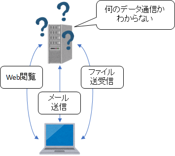
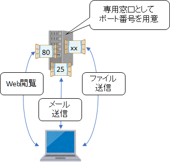
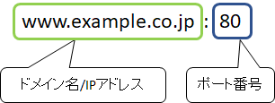
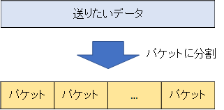
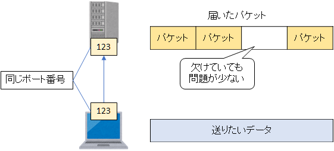
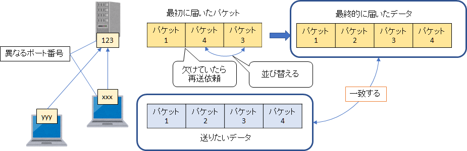

第6章 基本的な通信プロトコル
=====

[↑ 目次](README.md "目次")

[← 第5章 アドレスと名前](05.md "第5章 アドレスと名前")


ポート番号
-----

5章までの内容で、データ通信にはアドレスが必要で、そのアドレスはDNSを使って名前と対応付けられることが分かりました。今度は、より具体的なデータ通信方法を考えていきましょう。

さて、私たちが必要としているデータ通信は一体何種類くらいあるでしょうか？普段何気なく使っているものでも、Web閲覧、メール送信、ファイルと、いくつもあることが分かると思います。これらの「異なるデータ通信」を同じIPアドレスに向けて行うと、受け取った側ではそれが何のデータなのか判断がつきません。



図6-1 あらゆるデータ通信がある

そこで、このデータ通信の種類ごとに専用の窓口を設けることで、異なるデータ通信の種類を同時に扱えるようにする仕組みがあります。それが「ポート番号」です。

例えば、Webサイトを持つWebサーバーでは、80番のポートを専用に用意しています。なので、Webを閲覧するには、Webサーバーのアドレスと80番という番号を添えて、データ通信を行えばよいことになります。



図6-2 ポート番号

ポート番号を指定するには、`www.example.co.jp:80`のように、通信先の名前/IPアドレスの後に`:`で区切ってその番号を指定します。



図6-3 ポート番号の指定方法

試しに、「[http://www.google.com:80](http://www.google.com:80)」をWebブラウザーで開いてみると、ポート番号を指定しないときと同じようにページが表示されることが分かります。次に「[http://www.google.com:81](http://www.google.com:81)」のように80番以外のポートをして開くと、今度はWebページは見れなくなってしまいます。

なお、80番ポートはWebアクセス用の既定ポート番号なので、Webブラウザーはそれをつけなくても勝手に80番ポートにアクセスしてくれます。そのため、「～:80」のように指定してページを開くと、`:80`が省略されます。


トランスポート層の通信プロトコル
-----

IPアドレスは第3層である「ネットワーク層」のものでした。ポート番号はその上に重ねて指定するものなので、層としては第4層の「トランスポート層」の概念です。

このポート番号を指定して通信するための「トランスポート層」のプロトコルには主に次の2つがあります。

- UDP:**U**ser **D**atagram **P**rotocol  
- TCP:**T**ransmission **C**ontrol **P**rotocol  

どちらのプロトコルでも、大きなデータは「パケット」という小さな単位に分割してやり取りされます。このパケットが、通信状況によっては失われたり、前後したりすることがあるのです。そういったときの対処方法がUDPとTCPでは違っています。



図6-4 パケットに分割

### UDP

UDP一方的にデータを送り付けるためのプロトコルです。一部のパケットが失われても問題がないようなデータ通信で使われます。

例えば、DHCPクライアントが最初にブロードキャストするデータは、とても小さくまず破損する恐れがないため、UDPで送られます。他にも、音声や動画のストリーミング放送では、一部のデータが失われてもすぐに次のデータを処理すればよいだけなので、UDPが使われることがあります。



図6-5 UDP

なお、UDPではデータ送信元と先で両方同じポート番号を使うことになっています。

### TCP

UDPとは違い、TCPはデータの破損がないことを保証しながらデータを送るプロトコルです。普段使っているデータ通信の大半はTCPが使われています。

TCPでは送るパケットに番号を付けます。この番号を使うことで宛先でデータを正しい順番に並び替えることができます。また、不足しているときは、足りない番号のパケットを送信元に連絡し、再度送ってもらいます。こうして過不足なくパケットを揃えてデータを復元するのです。

なお、TCPではデータ送信元と先で異なるポート番号が使われます。例えば、Webサーバーのポート番号は前述のように80番ですが、PC側のポート番号はまちまちな番号になります。



図6-6 TCP

ちなみに、TCPとUDP、IPを合わせて、まとめて「TCP/IP」と呼び、インターネットを支える基本的なプロトコルとして知られています。


使用中のポートを確認する
-----

TCP/UDPで使用中のポートを確認するには、`netstat`コマンドを使います。次のように`-n`オプションを付けて実行することで、ローカルPCと接続先で使用中のIPアドレス、ポート番号が一覧で表示されます。

```
C:\>netstat -n

アクティブな接続

  プロトコル  ローカル アドレス      外部アドレス           状態
  TCP         127.0.0.1:40000        127.0.0.1:49775        ESTABLISHED
  TCP         127.0.0.1:49775        127.0.0.1:40000        ESTABLISHED
  TCP         127.0.0.1:52300        127.0.0.1:62295        ESTABLISHED
  TCP         127.0.0.1:55657        127.0.0.1:52304        TIME_WAIT
  TCP         127.0.0.1:55660        127.0.0.1:52304        TIME_WAIT
  TCP         127.0.0.1:61723        127.0.0.1:61724        ESTABLISHED
  TCP         127.0.0.1:61724        127.0.0.1:61723        ESTABLISHED
  TCP         127.0.0.1:62295        127.0.0.1:52300        ESTABLISHED
  TCP         192.168.2.122:55474    192.168.0.29:445       ESTABLISHED
  TCP         192.168.2.122:55483    162.247.242.20:443     ESTABLISHED
  TCP         192.168.2.122:55605    54.199.203.34:443      ESTABLISHED
  TCP         192.168.2.122:55634    23.210.232.194:80      TIME_WAIT
  TCP         192.168.2.122:55658    58.89.214.216:110      TIME_WAIT
  TCP         192.168.2.122:55659    35.167.66.47:443       ESTABLISHED
  TCP         192.168.2.122:55661    192.168.0.45:135       ESTABLISHED
  TCP         192.168.2.122:55662    192.168.0.45:49155     ESTABLISHED
  TCP         192.168.2.122:55665    192.168.0.45:445       ESTABLISHED
  TCP         192.168.2.122:59932    40.115.241.137:3389    ESTABLISHED
  TCP         192.168.2.122:61899    64.233.188.188:5228    ESTABLISHED
  TCP         192.168.2.122:62500    52.198.197.38:443      ESTABLISHED
  TCP         192.168.2.122:63467    52.230.85.180:443      ESTABLISHED
  TCP         [::1]:49802            [::1]:49804            ESTABLISHED
  TCP         [::1]:49804            [::1]:49802            ESTABLISHED
  ```

また、「管理者として実行」したコマンドプロンプト上であれば、`-b`オプションと併用することで、どの実行ファイルがポートを使っているかもわかります。

```
  C:\WINDOWS\system32>netstat -bn

アクティブな接続

  プロトコル  ローカル アドレス      外部アドレス           状態
  TCP         127.0.0.1:40000        127.0.0.1:49775        ESTABLISHED
 [TmPfw.exe]
  TCP         127.0.0.1:49775        127.0.0.1:40000        ESTABLISHED
 [tmlisten.exe]
  TCP         127.0.0.1:52300        127.0.0.1:62295        ESTABLISHED
 [thunderbird.exe]
  TCP         127.0.0.1:61724        127.0.0.1:61723        ESTABLISHED
 [thunderbird.exe]
  TCP         127.0.0.1:62295        127.0.0.1:52300        ESTABLISHED
 [chrome.exe]
  TCP         192.168.2.122:55665    192.168.0.45:445       ESTABLISHED
 所有者情報を取得できません
  TCP         192.168.2.122:55680    54.199.203.34:443      ESTABLISHED
 [chrome.exe]
  TCP         192.168.2.122:55694    13.114.125.140:443     CLOSE_WAIT
 [chrome.exe]
  TCP         192.168.2.122:55700    192.168.0.45:49155     TIME_WAIT
  TCP         192.168.2.122:55711    111.221.29.254:443     TIME_WAIT
  TCP         192.168.2.122:55724    54.213.97.162:443      ESTABLISHED
 [chrome.exe]
  TCP         192.168.2.122:59932    40.115.241.137:3389    ESTABLISHED
 [mstsc.exe]
  TCP         192.168.2.122:61899    64.233.188.188:5228    ESTABLISHED
 [chrome.exe]
  TCP         192.168.2.122:62500    52.198.197.38:443      ESTABLISHED
 [chrome.exe]
  TCP         192.168.2.122:63467    52.230.85.180:443      ESTABLISHED
  WpnService
 [svchost.exe]
  TCP         [::1]:49802            [::1]:49804            ESTABLISHED
 [LMS.exe]
  TCP         [::1]:49804            [::1]:49802            ESTABLISHED
 [LMS.exe]
  TCP         [::1]:52306            [::1]:55709            TIME_WAIT
  TCP         [::1]:52306            [::1]:55712            TIME_WAIT
  TCP         [::1]:52306            [::1]:55713            TIME_WAIT
  TCP         [::1]:52306            [::1]:55714            TIME_WAIT
  TCP         [::1]:52306            [::1]:55715            TIME_WAIT
  TCP         [::1]:52306            [::1]:55719            TIME_WAIT
  TCP         [::1]:52306            [::1]:55720            TIME_WAIT
  TCP         [::1]:52306            [::1]:55721            TIME_WAIT
  TCP         [::1]:52306            [::1]:55722            TIME_WAIT
  TCP         [::1]:52306            [::1]:55723            TIME_WAIT
```

- - - - -

#### [コラム] 自分自身のアドレスと名前

IPアドレス`127.0.0.1`は「自分自身」を表す特別なIPアドレスです。このアドレスを「ローカルループバックアドレス」といいます。

この他に、やはり「自分自身」を表す名前もあり、こちらは`localhost`です。

PCのネットワーク機能が有効かどうかを試すため、`127.0.0.1`や`localhost`相手に`ping`コマンドを実行するといった用途に使われます。

- - - - -

私たちが使っているアプリケーションはほぼUDP、TCPの上で通信が行われています。次の章ではそれらの中のいくつかを学びましょう。

[→ 第7章 応用的な通信プロトコル](07.md "第7章 応用的な通信プロトコル")