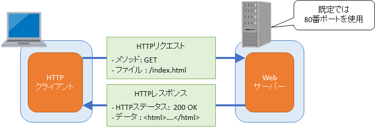
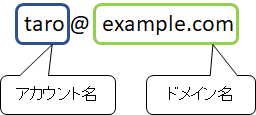
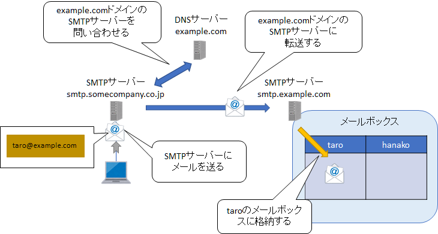
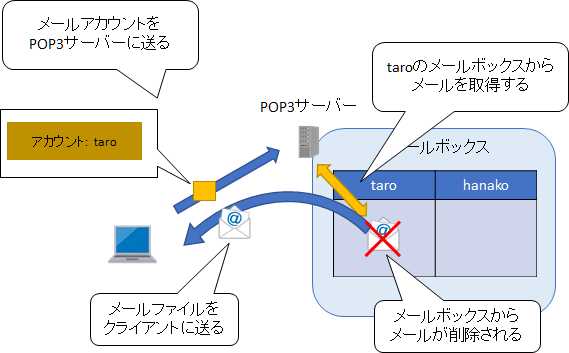
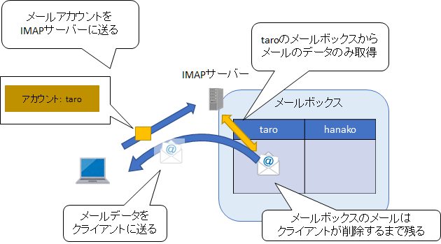

第7章 応用的な通信プロトコル
=====

[↑ 目次](README.md "目次")

[← 第6章 基本的な通信プロトコル](06.md "第6章 基本的な通信プロトコル")

TCP/UDPといった基本的なプロトコルを使い、その上でさらに応用的な通信プロトコルを使うことで、様々なアプリケーションでデータ通信が行えます。その中からいくつかを簡単に紹介します。

HTTP : **H**yper**T**ext **T**ransfer **P**rotocol
-----

Webページのデータ通信に用いられるプロトコルが「HTTP」です。「Hypertext」とはリンクや装飾などを使えるテキストデータのことで、Webが生まれた頃はそういったHypertextを送受信していたので、この名前になっています。現代では、Hypertextに限らず多種多様なデータ通信に用いられており、現代の情報社会の要となっているプロトコルでもあります。

図7-1 HTTP

HTTPは既定では80番ポートを使ったTCP接続を使って行われます。

まず、「HTTPクライアント」がサーバーの名前/IPアドレスとポートを指定してデータ通信を要求します。これを「HTTPリクエスト」と呼びます。

HTTPリクエストには、次の「メソッド」と対象となるファイルの場所および送信するデータが含まれます。

- GET : データ取得
- POST : データ送信
- PUT : データ変更
- DELETE : データ削除

例えば「GET」メソッドを使い「/index.html」というファイルの場所を指定した場合は、「/index.html」というファイルのデータを返送するようにサーバーに要求することになります。

HTTPリクエストは「Webサーバー」が受け取り、前述のメソッド等を判断し、データを返送します。これを「HTTPレスポンス」と言います。

HTTPレスポンスには、処理結果を表す次のような「HTTPステータス」と返送するデータが含まれています。

- 200 : OK(正常終了)
- 404 : Not Found(要求されたファイルなし)
- 501 : Service Unavailable(サーバーの状態がおかしい)

アプリケーションではHTTPクライアントを通じてHTTPレスポンスの結果を判断し、HTTPステータスが200なら受け取ったデータを表示、404ならデータがなかったとメッセージを表示、といった適切な処理を行います。

ちなみに、Webページは「HTML(**H**yper**T**ext **M**arkup **L**anguage)」と呼ばれる、専用の記述言語で書かれています。HTMLは`<html>...</html>`のような「タグ」と呼ばれる要素を組み合わせて、装飾やリンクを表現します。

SMTP : **S**imple **M**ail **T**ransfer **P**rotocol
-----

Eメール送信に使われるプロトコルが「SMTP」です。各種のチャットツールなどが発達した現代でも、取引先との情報交換などを中心にまだまだ非常に使われているプロトコルです。

まずSMTPでは「Eメールアドレス」を使って宛先を指定します。

図7-2 Eメールアドレス

Eメールアドレスの`@`より後がドメイン名、前がアカウント名です。例えば、`taro@example.com`というアドレスの場合、ドメイン名は`example.com`、アカウント名は`taro`です。

このEメールアドレスを付けてSMTPサーバーにデータを送ります。

図7-3 SMTP

SMTPサーバーは各ドメイン毎に存在しており、送られたEメールのアドレスを見て、自分のドメイン宛なら指定されたアカウントのメールボックスにメールを格納します。そして、他のドメインであれば、そのドメインのSMTPサーバーにデータを転送します。

各ドメインに配置されたSMTPサーバーのIPアドレスは、第5章で紹介したDNSサーバーを使って知ることができます。DNSサーバーはSMTPサーバー専用の情報を持つことができるので、その情報を問い合わせることで、SMTPサーバーのIPアドレスが分かります。

メールボックスに格納されたEメールは、別のプロトコルを使ってデータを取得します。

POP3 : **P**ost **O**ffice **P**rotocol version **3** および IMAP : **I**nternet **M**ail **A**ccess **P**rotocol
-----

SMTPで送られたメールを、メールボックスから取り出すためのプロトコルの一つが「POP3」です。

図7-4 POP3

POP3ではPOP3サーバーに対してアカウントの情報を提示することで、そのアカウントのメールボックスからメールを取り出します。取り出したメールは、メールボックスから削除されます。

メールデータを取得するためのプロトコルにはもう一つ「IMAP」というものもあります。

図7-5 IMAP

こちらはPOP3とは違い、メールデータはサーバー上に残したまま閲覧や削除などの操作を行います。

- - - - -

様々なプロトコルが使われていることが分かったところで、次の章では最後に安全な通信を行うための方法について学びましょう。

[→ 第8章 安全な通信](08.md "第8章 安全な通信")

