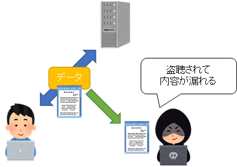
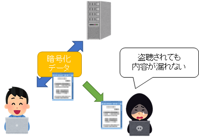
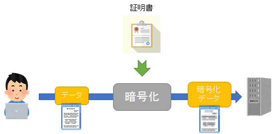
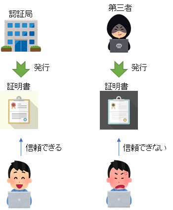
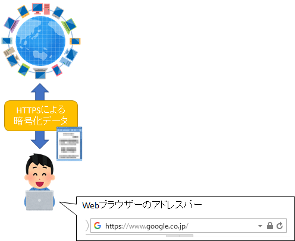
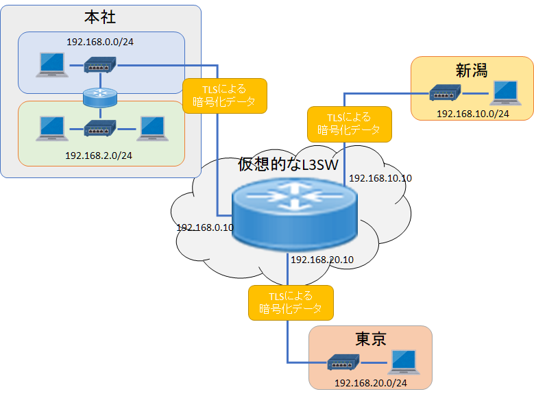
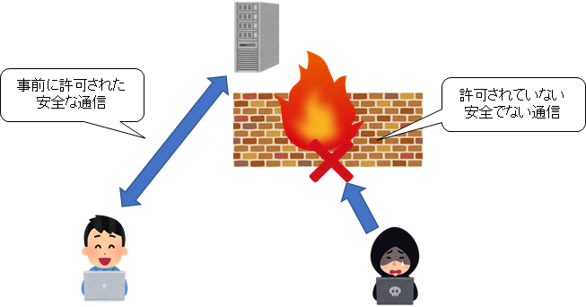
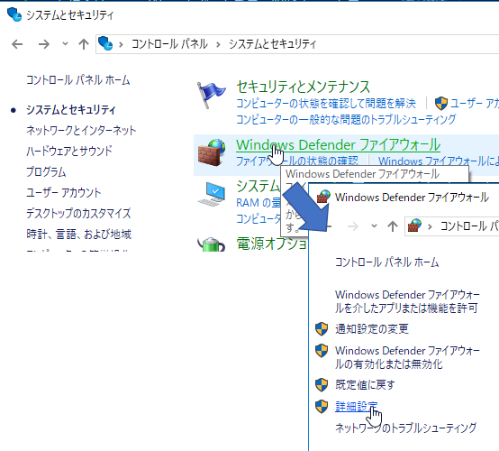
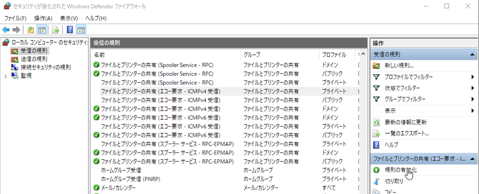

第8章 安全な通信
=====

[↑ 目次](README.md "目次")

[← 第7章 応用的な通信プロトコル](07.md "第7章 応用的な通信プロトコル")

安全な通信の必要性
-----

ネットワークを流れるデータは言ってみればただの電気信号や光信号でしかありません。したがって、やろうと思えばいくらでもデータを盗み見ることがでm。このデータを盗み見ることは「盗聴」とも言います。

このことを踏まえると、まだ会社のフロア内であれば施錠や入退室管理などで盗聴をある程度防ぐことができるかもしれません。しかしいったん外のネットワークに出てしまえば、盗聴を防ぐことはできません。



図8-1 通信の盗聴

したがって、「盗聴されてもよい形のデータ」で通信を行うのが鉄則となります。この盗聴されても安全な形式のデータへの変換のことを、「データの暗号化」と言います。反対に、暗号化されたデータを元に戻すことを「復号」といいます(「～化」とならないことに注意)。

暗号化されたデータであれば、途中の経路で盗聴されても、第三者に内容が漏れることはありません。



図8-2 通信の暗号化

本章では安全な通信を行うためのプロトコルについて、いくつか学びましょう。

TLS : **T**ransport **L**ayer **S**ecurity
-----

インターネットを介したデータ通信を安全に行うためのプロトコルが「TLS」です。

TLSでは「証明書」と言うものを使い、サーバーやクライアントのデータを暗号化して通信を行います。



図8-3 TLS

TLSで使われる証明書は、その名の通りサーバーやクライアントの正当性を証明するためのもので、世界にいくつかある信頼された「認証局」により発行されます。一応自分で勝手に証明書を発行することもできますが、第三者により信頼されたものではないので、暗号化はできてもデータの送り主の正当性を担保することはできません。



図8-4 証明書

なお、TLSを用いてデータを暗号化したHTTP通信はHTTPSと呼ばれます。WebブラウザーでWebサイトを見たとき、アドレスバーに鍵マークなどが出ていれば、それはHTTPSにより通信されていることを表しています。



図8-5 HTTPS

ちなみに、2018年現在では世界中のHTTP通信はどんどんHTTPSに置き換えようとされています。今後Webサイトなどを公開しようとする際は、HTTPSを使う前提となることを覚えておいてください。


VPN : **V**irtual **P**rivate **N**etwork
-----

当社のように複数拠点で仕事をしている組織では、拠点をまたいで安全にデータをやり取りしたという要求が当然出てきます。

もちろんHTTPSを通じてすべてをWebでやり取りすることも可能です。しかし、ファイルの共有やデータの共有などを、あたかも直接接続されたネットワーク内で行えるようにしたいものです。

そういった問題を解決するためのプロトコルが「VPN」です。VPNでは、複数の拠点に離れたネットワークを、TLSなどを用いた暗号化通信を使うことで、まるでL3SWで接続したように、安全にデータのやり取りが行えます。



図8-6 VPN

現在でも多く使われているVPNの一つが、各事業所に「VPNルーター」という機器を置き、それぞれを本社とインターネット経由で接続する「Internet VPN」です。各事業所の「VPNルーター」にはL3SWの各ポートのように、異なるネットワークのIPアドレスが設定され、ルーティングされます。

このことを確かめるために、他の事業所のVPNルーターのアドレス宛に`tracert`コマンドを実行してみると、インターネットのアドレスは経由せずに、直接アクセスしていることが分かります。

```
C:\>tracert 192.168.10.10

192.168.4.5 へのルートをトレースしています。経由するホップ数は最大 30 です

  1     3 ms     3 ms     5 ms  192.168.2.251
  2     1 ms     1 ms     1 ms  192.168.0.5
  3    24 ms    24 ms    24 ms  192.168.10.10

トレースを完了しました。
```

安全でない通信を遮断する
-----

安全な通信を行うための方法は暗号化だけではありません。そもそも安全でない通信自体を行えないように遮断することもできます。この遮断するための機能を「ファイアウォール(FW:**F**ire **W**all)」といいます。



図8-7 ファイアウォール

ファイアウォールには遮断する通信を判断する方法によっていくつか種類がありますが、通常単に「ファイアウォール」と言った場合は、IPアドレスとポート番号で判断する、トランスポート層のものを指すことが多いようです。

例えばWebサイトをホストするサーバーの場合、ファイアウォールで80番ポートのみ通信を許可するよう設定することで、他の「安全でない」通信を遮断できます。もちろん、「管理用」に接続して操作するためのポートも有効にしておかなければなりませんが、なんでも通信を許すようにするよりは、はるかに安全になります。

Windowsでファイアウォールを設定するには、［コントロールパネル］の［システムとセキュリティ］－［Windows Defender ファイアウォール］を使います。



図8-8 Windows Defender ファイアウォール

「Windows Defender ファイアウォール」の［詳細設定］をクリックすると、様々な通信に対する設定が事前に用意されているのが分かります。

例えば、既定で無効になっている`ping`コマンドへの応答を返すようにするには、「ICMP」というプロトコルの「エコー要求」を許可するようにしなければなりません。そのためには、「ファイルとプリンターの共有 (エコ－要求 - ICMPv4 受信)」を選び、［規則の有効化］をクリックします。



図8-9 Windows Defender ファイアウォールの詳細設定

- - - - -

さて、8章にわたってネットワークのほんの入り口について説明してきました。

簡潔な説明のため、詳細な部分を大幅にカットしている箇所も多くあります。また、まだまだ説明していない大事なプロトコルもたくさんあります。

したがって、本テキストの内容だけで満足せずに、参考資料に挙げたWebサイトなどで、足りない部分を徐々に補うようにしてください。ネットワークは現在の情報システムを支える大事な「インフラ」です。ぜひ、正しい知識をしっかりと身に付けるようにしてください。